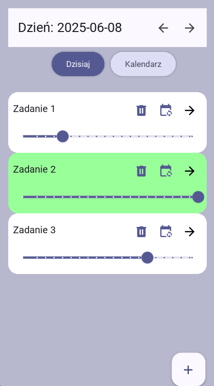
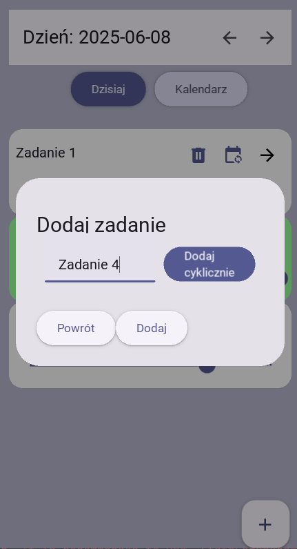
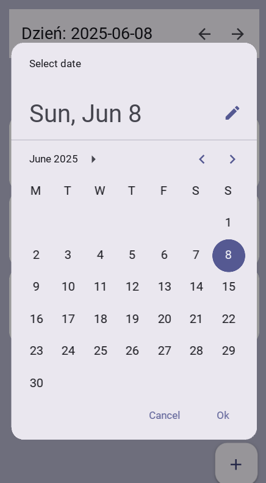

# DayPlanner App

Aplikacja mobilna do planowania zadań dziennych, napisana w Pythonie z użyciem frameworka **KivyMD** i bazy danych SQLite. Umożliwia tworzenie, edytowanie, usuwanie oraz śledzenie postępów w realizacji zadań przypisanych do konkretnych dni.

---

## Funkcje

- Dodawanie zadań do wybranego dnia
- Dodawanie zadań cyklicznych (co tydzień przez 30 dni)
- Wybór daty z kalendarza
- Nawigacja po dniach (poprzedni / następny)
- Ustawianie postępu zadania (0–100%) oraz automatyczne oznaczanie jako ukończone
- Usuwanie zadań
- Zmiana daty zadania (przesunięcie np. o jeden dzień)
- Kolorowe oznaczanie ukończonych zadań

---

## Struktura projektu

```
.
├── main.py
├── screens/
│   ├── homeScreen.py
│   ├── addTaskDialog.py
│   ├── calendar.py
│   ├── datePicker.py
│   ├── eventBus.py
│   └── taskBox.py
├── database/
│   ├── models.py
│   └── crud.py
├── kv/
│   ├── home_screen.kv
│   ├── add_task_dialog.kv
│   └── task_box.kv
└── planer.db (tworzony automatycznie)
```

---

## Wymagania

- Python 3.7+
- Kivy
- KivyMD
- SQLAlchemy
- Szczegółowe dane o bibliotekach: [requirements.txt](requirements.txt)

---

## Instalacja

1. **Zainstaluj zależności:**

```bash
pip install kivy kivymd sqlalchemy
```

2. **Uruchom aplikację:**

```bash
python main.py
```

---

## Użycie

- Ekran główny wyświetla zadania na dzisiejszy dzień.
- Za pomocą górnego paska możesz:
  - dodać nowe zadanie
  - wybrać inną datę z kalendarza
  - wrócić do dzisiejszego dnia
- Każde zadanie możesz:
  - przesunąć na inny dzień
  - ustawić postęp (slider)
  - usunąć

---

## Baza danych

- Baza oparta o SQLite.
- Plik `planer.db` tworzony automatycznie w katalogu aplikacji.
- Model `Task` zawiera:
  - `id`, `name`, `description`, `progress`, `completed`, `date`.

---

## Wzorce projektowe

- **Singleton** — klasa `Database` zapewnia jedną instancję połączenia z bazą.
- **Factory** — `TaskBoxFactory` do tworzenia widżetów zadań.
- **Observer (EventBus)** — komunikacja między komponentami aplikacji.

---

## Zrzuty ekranu





---

## Licencja

Projekt open-source — możesz używać, modyfikować i rozwijać go dalej.

---

## Repozytorium Git

https://github.com/Mrk-Ga/DayPlannerApp

---

## Autor

Marek Gagaczowski